# turboquant-cuda-bench

[](LICENSE)
[](https://github.com/sztlink/turboquant-cuda-bench/commits/main)
[](https://github.com/sztlink/turboquant-cuda-bench/issues)
[](https://github.com/sztlink/turboquant-cuda-bench/discussions)

> **Position/rank/recency sensitivity in controlled evidence placement** — public HotpotQA + long-context/KV-cache receipts with Qwen3/Qwen2.5, llama.cpp, vLLM, TurboQuant, CASK, and local RTX 4090 runs.
>
> Shorthand, not thesis: **retrieved ≠ used** means retrieval/presence is operationally separated from answer closure in these probes. It is not a claim about dominant production RAG bottlenecks or internal evidence use.

This is a public research archive for answer-closure diagnostics, long-context quality probes, and KV-cache experiments on local GPUs.

Read it as three paths:

1. **Evidence placement / answer-closure diagnostics** — public HotpotQA R1/R2/R3A/R3B/R3C and synthetic probes showing position, rank, recency, prompt, reranker, metric-audit, and distractor effects.
2. **Bridge methodology** — KV/cache changes can preserve action or rank while losing payload identity.
3. **Evidence-Paged KV** — exploratory kernel/runtime observability receipts, not a production hook.

Boundary: this repo is receipts-first systems research. It does not claim serving speedup, production attention, production RAG value, dominant RAG bottlenecks, answer-quality improvement, or proof that selected positions are model evidence use.

<p>
  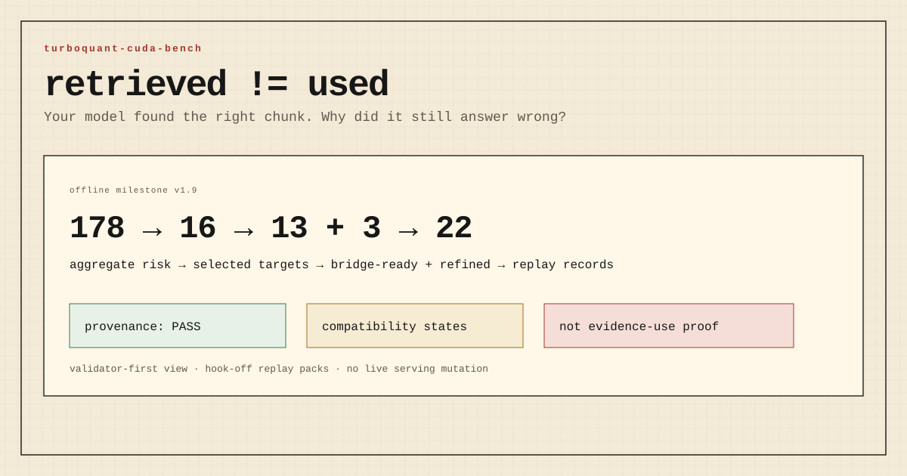
</p>

<p>
  
</p>

## TL;DR

| Finding | Concrete receipt | Why it matters | Public entry |
|---|---|---|---|
| **Public HotpotQA answer closure is position-sensitive.** | R1 full: **7,384** HotpotQA dev distractor questions, **36,920** records, **0 errors**. `oracle_first` closure **51.1%**, `oracle_last` **42.7%**, `distractor_first` **38.5%**, `no_support` **6.8%**. | Public multi-hop QA shows closure changes when gold supporting evidence is present but ordered differently. | [R1](bench-public/evidence-utilization/REALRAG-HOTPOTQA-R1.md) |
| **The rank curve is positional, not monotonic.** | R2 full: **44,304** records. `rank_1` **51.4%** > `rank_last` **42.4%** > `rank_3` **40.4%** > `rank_8` **38.7%** ≈ `rank_5` **38.6%** >> `no_support` **6.9%**. | Beginning helps, middle burial hurts, end placement partially recovers. | [R2](bench-public/evidence-utilization/REALRAG-HOTPOTQA-R2-RANKCURVE.md) |
| **Simple citation/reasoning prompts do not erase the position effect.** | R3A: **1,991** questions, **23,892** records, **0 errors**. `direct`: `rank_1` **51.5%**, `rank_5` **38.4%**; `cite`: **48.0%** vs **37.2%**; `reason`: **52.3%** vs **39.3%**. | Prompting can change closure/leakage, but the rank-position gap remains. | [R3A](bench-public/evidence-utilization/REALRAG-HOTPOTQA-R3A-PROMPTVARIANTS.md) |
| **A strong reranker closes most of the natural BM25-to-oracle gap.** | R3B: **1,991** questions, **7,964** records, **0 errors**. `bm25_top10` **45.8%**, `bge_rerank_top10` **50.1%**, `oracle_first` **51.2%**, `no_support` **6.8%**. | Position/rank is actionable: BGE moves support toward rank 1 and nearly reaches the oracle ceiling on this slice. | [R3B](bench-public/evidence-utilization/REALRAG-HOTPOTQA-R3B-NATURAL-RETRIEVAL.md) |
| **Metric/support audit is now the next gate.** | R3C: R3B support-present conditions have **100%** supporting-fact sentence recall; BGE improves SF sentence rank mean **3.17 → 1.77**. Audit buckets expose alias/partial/no-support leakage cases. | Remaining failures should be judged as correct/partial/wrong/ambiguous/metric artifact before broader claims. | [R3C](bench-public/evidence-utilization/REALRAG-HOTPOTQA-R3C-METRIC-AUDIT.md) |
| **Synthetic fixtures show stronger rank/decoy effects.** | Evidence-utilization phase: **11,376** synthetic runs, **7,902/11,376** closures (**69.5%**), **0 errors**. | Synthetic probes isolate rank, decoys-before, and distractor type before public-dataset validation. | [`bench-public/evidence-utilization/`](bench-public/evidence-utilization/) |
| **Rank and decoys dominate more than raw depth in synthetic probes.** | Distractor taxonomy: rank 1 closed **98.9%**, rank 16 closed **23.2%**. Stale records closed **36.1%** vs unrelated noise **84.2%**. | Long context is not enough if the right chunk loses local evidence competition. | [`KEY-FINDINGS.md`](KEY-FINDINGS.md) |
| **192K needle retrieval passes, but decoy answer closure still fails.** | vLLM Qwen2.5-7B + TurboQuant K8V4: **5/5** at 128K, 160K, 192K. Decoy replay at top_k=16: **5/8** across llama.cpp Qwen 27B and vLLM Qwen 7B; `DECOY-0616-1` repeats byte-identically. | The bottleneck is not just context length or backend. It is presentation, rank, and competing evidence. | [`bench-public/vllm-cross-stack/`](bench-public/vllm-cross-stack/) |
| **KVFidelity sees trace drift hidden by pass/fail.** | N=28: same-config controls **100% stable**; q8/q8→q8/turbo3 action-class **82.1%**, semantic **53.6%**, full-signature **50.0%**. Hold-out narrowed the claim: q8/turbo3 **20/20 equivalent**, q8/turbo2 retained one moderate regression. | Do not claim “KV compression breaks agents.” Claim: pass/fail can miss action-trace changes. | [`bench-public/kvfidelity/`](bench-public/kvfidelity/) |
| **Action, target, and source-rank fidelity can split.** | CASK bridge v2: FullKV **119/120** exact. CASK b512: action **117/120**, rank **108/120**, target **2/120**. CASK b2048 returns to **119/120** exact. | Compression may preserve operation/rank while losing payload identity. Separate the layers. | [`bench-public/cask-kvfidelity-bridge/`](bench-public/cask-kvfidelity-bridge/) |
| **Evidence-Paged KV has CUDA receipts, not a production hook.** | v4: score → top-k/softmax → value path; v5: custom top-k/value wins for `K=32`; v7: best no-full-score-materialization architecture but not fastest at scale. | The idea now has kernel and offline telemetry receipts; live hook-on remains paused behind an explicit runtime gate. | [`bench-public/evidence-paged-kv/`](bench-public/evidence-paged-kv/) |

Start here:

- [KEY-FINDINGS.md](KEY-FINDINGS.md) - actionable public summary.
- [RealRAG HotpotQA R1](bench-public/evidence-utilization/REALRAG-HOTPOTQA-R1.md) - public evidence-placement result.
- [RealRAG HotpotQA R2 rank curve](bench-public/evidence-utilization/REALRAG-HOTPOTQA-R2-RANKCURVE.md) - position/rank/recency curve.
- [RealRAG HotpotQA R3A prompt variants](bench-public/evidence-utilization/REALRAG-HOTPOTQA-R3A-PROMPTVARIANTS.md) - citation/reasoning prompt ablation.
- [RealRAG HotpotQA R3B natural retrieval](bench-public/evidence-utilization/REALRAG-HOTPOTQA-R3B-NATURAL-RETRIEVAL.md) - BM25 vs BGE reranker vs oracle/no-support.
- [RealRAG HotpotQA R3C metric audit](bench-public/evidence-utilization/REALRAG-HOTPOTQA-R3C-METRIC-AUDIT.md) - supporting-fact sentence audit and stratified samples.
- [RealRAG sample pack](bench-public/evidence-utilization/REALRAG-HOTPOTQA-SAMPLES-v1.md) - auditable question/prediction examples.
- [RealRAG R3 plan](bench-public/evidence-utilization/REALRAG-R3-PLAN.md) - remaining reranker/judging/dataset/model gates.
- [GLOSSARY.md](GLOSSARY.md) - terms and method names.
- [bench-public/](bench-public/) - public-safe result packages.
- [bench-public/dashboard.html](bench-public/dashboard.html) - static dashboard of the headline numbers.
- [bench-public/assets/](bench-public/assets/) - SVG cards/charts for the public readout.
- [Evidence-Paged KV kernel receipts](bench-public/evidence-paged-kv/) - CUDA v1→v7 summary, claims, non-claims, and next steps.
- [Evidence-Paged KV audit v1→v8](AUDIT-EVIDENCE-PAGED-KV-v1-v8.md) - frozen taxonomy and paused runtime criteria.
- [Evidence Path: three scenes where finding is not using](06-publicable/longctx/evidence-path/README.md) - readable narrative entry point.
- [CONTRIBUTING.md](CONTRIBUTING.md) - how to report reproductions, bugs, or suggested tests.
- [Welcome & Feedback thread](https://github.com/sztlink/turboquant-cuda-bench/discussions/2) - discussion entry point.

## Visual readout

<p>
  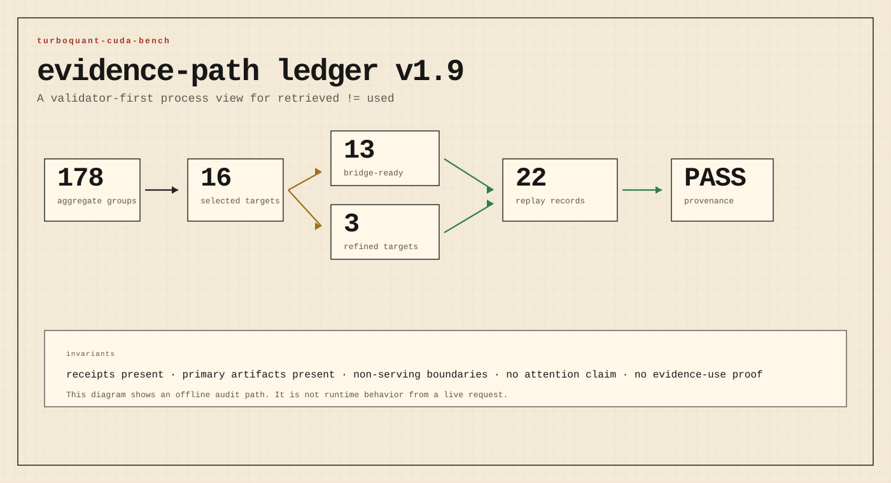
</p>

<p>
  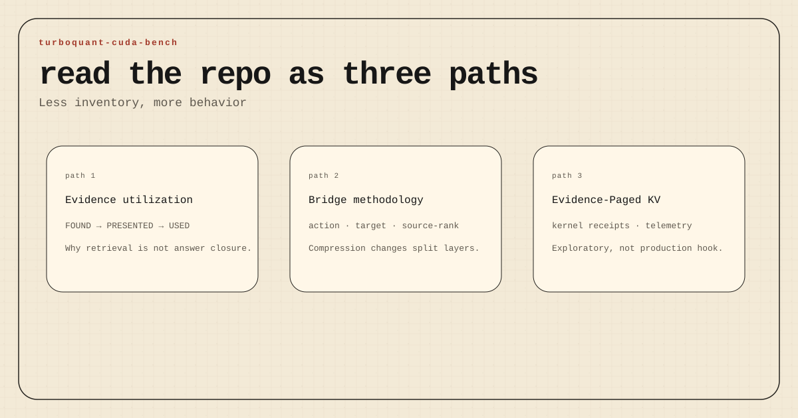
</p>

<p>
  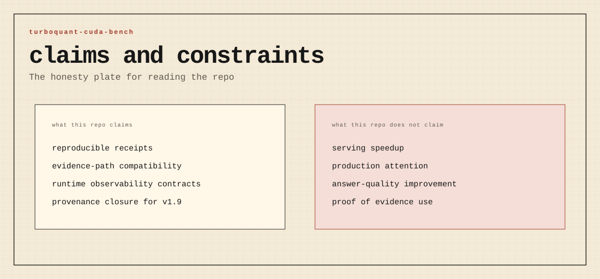
</p>

| Evidence utilization | Cross-stack behavior |
|---|---|
| 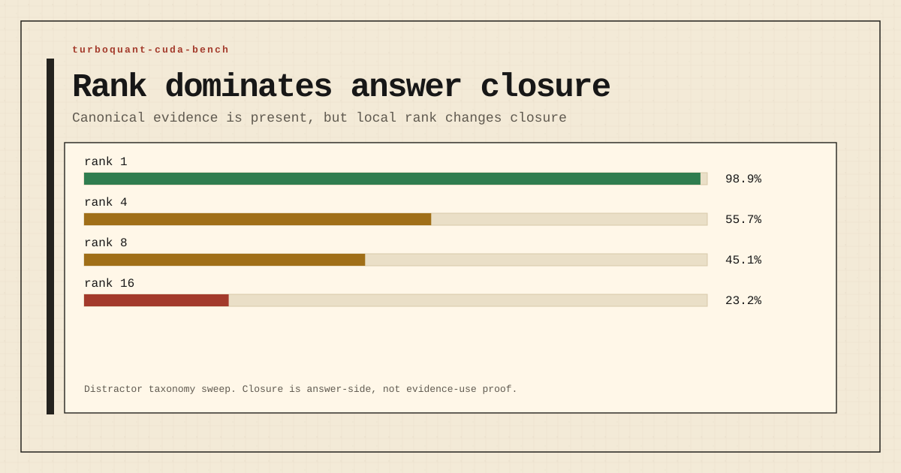 | 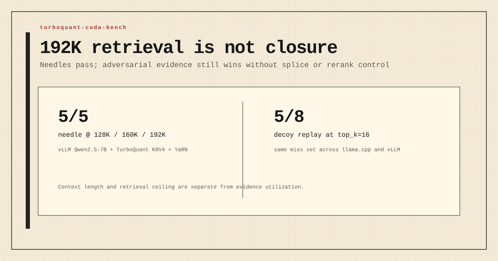 |
| 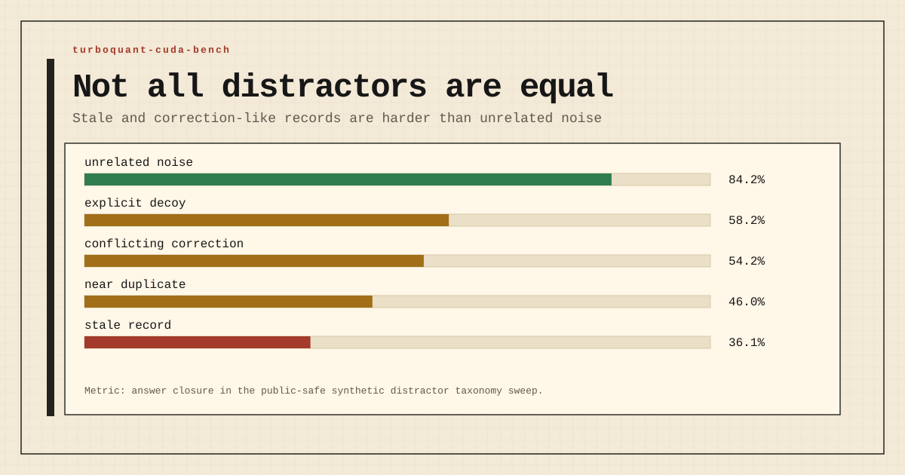 | 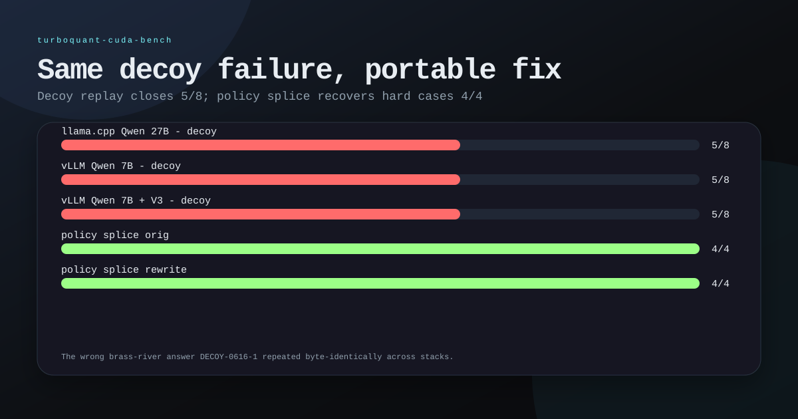 |

| KV/cache diagnostics | Bridge probe |
|---|---|
| 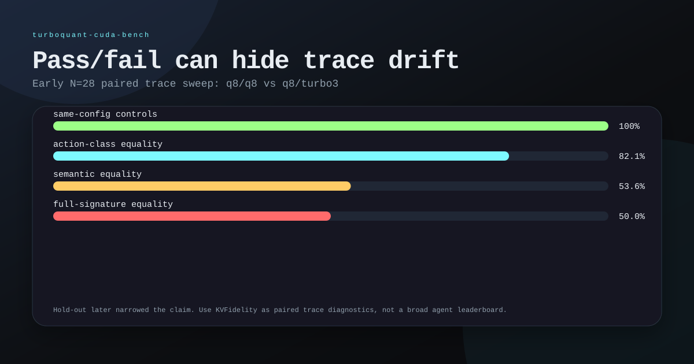 | 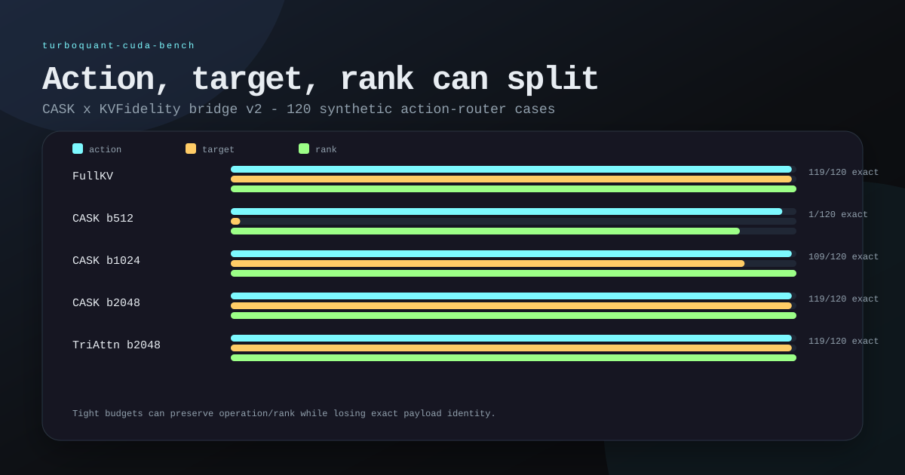 |

| Evidence-Paged KV receipts |
|---|
| 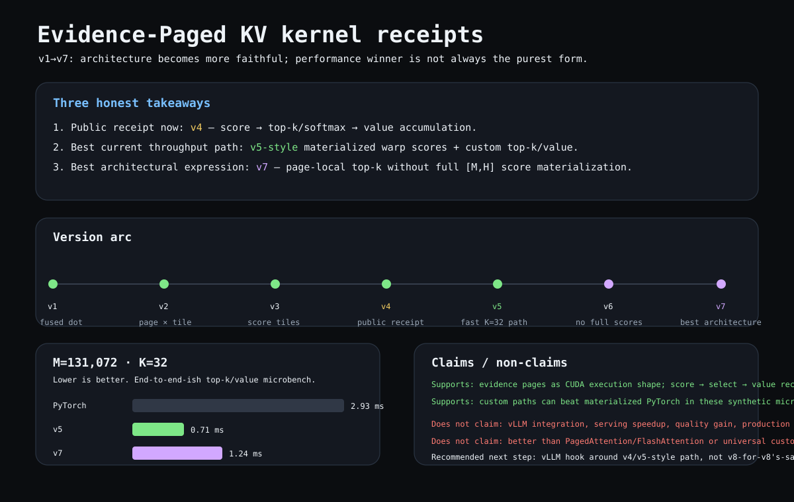 |

## Canonical research structure

This repository is the **material canonical archive** for the TurboQuant / KVFidelity front: protocols, raw logs, processed traces, scripts, analysis, and publicable artifacts. `memory-md` keeps synthesis and decisions; `/tmp` is only a scratch/bancada layer.

Other entry points:

- [CANON.md](CANON.md) - current canonical stance and caveats
- [MANIFEST.md](MANIFEST.md) - promoted artifacts and checksums
- [00-context/CURRENT.md](00-context/CURRENT.md) - current brief for the next session
- [CASK/KVFidelity Trace Atlas experiment](03-lab/experiments/2026-05-13-cask-aime24-n30-trace-atlas/experiment.md)
- [KVFidelity Trace Atlas lab note v2](05-analysis/kvfidelity/2026-05-15-trace-atlas-lab-note-v2.md)
- [KVFidelity Casey Atlas v4](06-publicable/kvfidelity/2026-05-trace-atlas-v4/)

## Hardware

| Machine | GPU | VRAM | SM | OS |
|---------|-----|------|----|----|
| aya2 | RTX 4090 | 24 GB | SM89 (Ada Lovelace) | Windows 11 |
| felipe-pc | RTX 3090 | 24 GB | SM86 (Ampere) | Windows 11 |

## Models covered

This repository contains CUDA benchmark data for several TurboQuant test targets:

| Model | Notes |
|-------|-------|
| **Qwen3.6-35B-A3B** Q4_K_M | MoE hybrid; 10 full-attention (GQA, 2 KV heads) + 40 GDN/Mamba recurrent. Production server target. |
| **Qwen3.6-27B** Q4_K_M | Dense model used for REFRACT GTM/Trajectory and DFlash tests. |
| **Qwen3-32B** Q4_K_M | Dense model used to test REFRACT scale sensitivity on SM86. |
| **Qwen2.5-0.5B / 7B / 7B-1M / 32B-AWQ** | vLLM-side targets for the 2026-05 cross-stack runs: smoke, needle (up to 192K with YaRN), decoy/resolution replay. |

Current 4090 service baseline: vLLM TurboQuant K8V4 on Qwen2.5-7B at 65K context. Historical llama.cpp baseline: TheTom fork, 65K ctx, flash-attn on.

## Builds

| Build | Commit | Notes |
|-------|--------|-------|
| TheTom HEAD | `11a241d0d` | sparse-V CUDA disabled (PR#105) |
| TheTom nosparse | `65a2c690f` | historical llama.cpp production server |
| spiritbuun TCQ | `2cc97a81c` | requires `-DGGML_CUDA_FA_ALL_QUANTS=ON` |
| TurboQuant attn-fix | `69d8e4be4` | REFRACT attn-fix rerun, `REFRACT_TRAJECTORY` patch, clean CUDA/C++ binary |
| **vllm-turboquant** | `36fc04825` | `feature/turboquant_plus` branch - vLLM CUDA path with TurboQuant + TriAttention V3. Build recipe: [`bench/vllm-smoke-2026-05-10/BUILD-CUDA.md`](bench/vllm-smoke-2026-05-10/BUILD-CUDA.md) |

## Benchmarks

| Date | Benchmark | What |
|------|-----------|------|
| 2026-04-13 | throughput-30b-moe (archived receipt; no promoted public folder) | Qwen3-30B-A3B MoE throughput + PPL |
| 2026-04-14 | [niah](bench/niah/) | NIAH retrieval q8_0-K+turbo3-V, 65K ctx |
| 2026-04-24 | [sparse-v](bench/sparse-v/) | sparse-V dequant skip - SM89 + SM86 |
| 2026-04-24 | [ppl-35b-a3b](bench/ppl-35b-a3b/) | PPL wikitext-2, Qwen3.6-35B-A3B |
| 2026-04-24 | [tg-context](bench/tg-context/) | TG vs ctx depth, turbo3 + turbo4 |
| 2026-04-27 | [iq4nl-repro](bench/iq4nl-repro/) | IQ4_NL vs Q4_K_M repro - @lkaupp case |
| 2026-05-03 | [dflash](bench/dflash/) | DFlash speculative decoding, 27B dense |
| 2026-05-05 | [refract-attnfix](bench/refract-attnfix/) | REFRACT attn-fix: GTM vs Trajectory, 27B+32B, SM86+SM89 |
| 2026-05-06 | [q4-hybrid-refract](bench/q4-hybrid-refract/) | REFRACT q4_0 KV on Qwen3.6-35B-A3B hybrid: KLD vs Trajectory |
| 2026-05-06 | [agentic-context-fidelity](bench/agentic-context-fidelity/) | A/B action-level fidelity smoke: q8/q8 vs q4/q4 through 32k |
| 2026-05-06 | [acf-ramp-protocol](notes/acf-ramp-protocol.md) | Draft threshold/ramp protocol for action-level fidelity, analogous to FTP testing |
| 2026-05-09 | [thetom-stack-smoke](bench/thetom-stack-smoke/) | Local adapter smoke for tqkit, REFRACT, and longctx-svc receipts |
| 2026-05-09 | [consumer-context](bench/consumer-context-2026-05-09/) | Consumer long-ctx fit/throughput probe, 27B q8/q8 + q8/turbo4 + turbo4/turbo4 on 4090 |
| 2026-05-10 | [consumer-boundary-clean](bench/consumer-boundary-clean-2026-05-10/) | 128K/160K/192K boundary bench with VRAM logging; q8/q8 times out at 192K, turbo4 fits |
| 2026-05-10 | [needle-retrieval](bench/needle-retrieval-2026-05-10/) | 5-position needle retrieval at 128K/160K/192K, Qwen 27B q8/turbo4 |
| 2026-05-10 | [longctx-proxy](bench/longctx-proxy-2026-05-10/) | First end-to-end test of `longctx-svc` proxy in front of `llama-server` on 4090 |
| 2026-05-10 | [longctx-proxy-hard](bench/longctx-proxy-hard-2026-05-10/) | Hard proxy sweep with decoys and top_k {2,4,8,16}; **retrieval 8/8 / answer 5/8** at k=16 |
| 2026-05-10 | [longctx-decoy-isolation](bench/longctx-decoy-isolation-2026-05-10/) + [longctx-decoy-resolution](bench/longctx-decoy-resolution-2026-05-10/) | Targeted resolution of the proxy-hard gap: reranker / policy_splice / query rewrite **→ 16/16** |
| 2026-05-16 | [longctx-utilization-overnight](bench/longctx-utilization-overnight-2026-05-16/) | Sanitized confirmation: retrieval 8/8 but baseline/anti-decoy prompt closure 5/8; filtered splice/oracle 8/8; targeted reranker rank 1 and closure 4/4 |
| 2026-05-16 | [longctx-utilization-expanded](bench/longctx-utilization-expanded-2026-05-16/) | Synthetic n=24 staging confirmation: retrieval 19/24; baseline/anti-decoy closure 9/24; filtered splice closure 19/24; includes 4090 preflight/watchdog structural note |
| 2026-05-16 | [longctx-rerank-timeout-smoke](bench/longctx-rerank-timeout-smoke-2026-05-16/) | Structural smoke for local `longctx-svc` patch: killable rerank timeout/fallback returns safely instead of hanging `/retrieve` |
| 2026-05-17 | [evidence-utilization-phase](bench/evidence-utilization-phase-2026-05-17/) | Synthetic phase package: depth sweep, prompt scaffolds, and distractor taxonomy. Rank / decoys-before / distractor type dominate closure more than raw context depth. |
| 2026-05-17 | [cask-kvfidelity-bridge-v2](bench/cask-kvfidelity-bridge-v2-2026-05-17/) | Synthetic action-router bridge: upstream KV/cache method → downstream action/target/source-rank fidelity. Shows action/rank can survive after exact payload identity fails under tight budgets. |
| 2026-05-10 | [vllm-migration-scout](bench/vllm-migration-scout-2026-05-10/) | Pre-WSL2 readiness scout for the vLLM CUDA branch (historical; superseded same day) |
| 2026-05-10 | [vllm-smoke](bench/vllm-smoke-2026-05-10/) | First-light vLLM TurboQuant on 4090 WSL2: Qwen 0.5B/8K, 7B/16K, 32B-AWQ/16K + 12-way concurrency w/ V3 enabled; includes [BUILD-CUDA.md](bench/vllm-smoke-2026-05-10/BUILD-CUDA.md) |
| 2026-05-11 | [vllm-needle](bench/vllm-needle-2026-05-11/) | Needle retrieval cross-stack: vLLM Qwen 2.5-7B + YaRN at 128K/160K/192K, with YaRN factor sweep at 160K |
| 2026-05-11 | [vllm-decoy](bench/vllm-decoy-2026-05-11/) | Decoy + resolution replay cross-stack: same prompts as llama-cpp, identical 5/8 → 4/4 numbers |

## Recent results

- **KVFidelity / action-trace synthesis (2026-05-07):** [summary](notes/kvfidelity-2026-05-07-summary.md)
- **Related work / terminology:** [positioning note](notes/kvfidelity-related-work.md)
- **Comparator v2 + same-build severity sweep:** [method/results](notes/kvfidelity-comparator-v2.md)
- **Frozen hold-out:** [protocol](notes/kvfidelity-holdout-protocol.md) · [reviewed result](notes/kvfidelity-holdout-result.md)
- **TC-31 steering/order follow-ups:** [steering](notes/kvfidelity-tc31-prompt-steering-result.md) · [batch/order](notes/kvfidelity-tc31-batch-order-result.md)
- **Order-sensitivity soak:** [protocol](notes/kvfidelity-order-sensitivity-soak-protocol.md) · [reviewed result](notes/kvfidelity-order-sensitivity-soak-result.md)
- **TheTom public-stack integration:** [integration note](notes/thetom-stack-integration.md) · [local smoke receipt](bench/thetom-stack-smoke/latest/RESULTS.md) · [REFRACT KLD fix smoke](bench/thetom-stack-smoke/refract-kldfix-2026-05-09/RESULTS.md) · [Qwen KLD smoke](bench/thetom-stack-smoke/qwen-kld-smoke-2026-05-09/RESULTS.md) · [Qwen KLD CLI receipt](bench/thetom-stack-smoke/qwen-kld-cli-2026-05-09/RESULTS.md)
- **Longctx decoy/ranking gap (2026-05-10, confirmed 2026-05-17):** `longctx-svc` proxy on 4090 + Qwen 27B reaches retrieval 8/8 at `top_k=16` but final-answer 5/8 - three handles where the canonical chunk was in context but the model emitted a decoy or refused. The 2026-05-16 sanitized rerun confirms anti-decoy prompting alone remains 5/8, while filtered splice/oracle recover 8/8. In the targeted resolution run, reranking puts canonical evidence at rank 1 with no decoy before it and closes 4/4. The expanded synthetic staging fixture repeats the same pattern at n=24: retrieval 19/24, baseline/anti-decoy closure 9/24, filtered splice closure 19/24. The 2026-05-17 phase package extends this across 11,376 promoted synthetic runs: depth 20k/80k/160k stayed close, baseline prompt beat negative/positive/structured scaffolds, and stale records / near-duplicates were much harder than unrelated noise. See [longctx-utilization-overnight](bench/longctx-utilization-overnight-2026-05-16/RESULTS.md), [longctx-utilization-expanded](bench/longctx-utilization-expanded-2026-05-16/RESULTS.md), and [evidence-utilization-phase](bench/evidence-utilization-phase-2026-05-17/RESULTS.md).
- **CASK × KVFidelity bridge (2026-05-17):** a 120-case synthetic action-router fixture separates upstream cache method from downstream `action` / `target` / `source_rank` fidelity. FullKV baseline was 119/120 exact. At tight budget 512, CASK preserved action 117/120 and rank 108/120 but exact target only 2/120; at 1024, CASK recovered to 109/120 exact; at 2048, CASK and TriAttention matched the FullKV ceiling on this fixture. This is a bridge/methodology probe, not a global method ranking. See [cask-kvfidelity-bridge-v2](bench/cask-kvfidelity-bridge-v2-2026-05-17/README.md).
- **RealRAG HotpotQA R1/R2/R3A/R3B public evidence-placement gates (2026-05-20):** HotpotQA dev distractor moves the evidence-placement claim beyond synthetic fixtures. R1 full run: 7,384 questions / 36,920 records / 0 errors; `oracle_first` 51.1% closure, `oracle_last` 42.7%, `distractor_first` 38.5%, `no_support` 6.8%. R2 rank curve: `rank_1` 51.4%, `rank_last` 42.4%, `rank_3` 40.4%, `rank_8` 38.7%, `rank_5` 38.6%, `no_support` 6.9%. R3A prompt ablation: direct/cite/reason variants keep large `rank_1 - rank_5` gaps (+13.1 pp, +10.8 pp, +13.1 pp). R3B natural retrieval: BGE reranking improves `bm25_top10` 45.8% to 50.1%, near `oracle_first` 51.2%. Interpretation: answer closure is position-sensitive, but strong reranking mitigates most of the natural BM25-to-oracle gap on this slice. See [R1](bench-public/evidence-utilization/REALRAG-HOTPOTQA-R1.md), [R2](bench-public/evidence-utilization/REALRAG-HOTPOTQA-R2-RANKCURVE.md), [R3A](bench-public/evidence-utilization/REALRAG-HOTPOTQA-R3A-PROMPTVARIANTS.md), and [R3B](bench-public/evidence-utilization/REALRAG-HOTPOTQA-R3B-NATURAL-RETRIEVAL.md).
- **Evidence-Paged KV kernel receipts and offline evidence-path ledger (2026-05-18/19):** v1→v7 CUDA microbenches explore evidence pages as an execution shape. Public readout: v4 is the cleanest end-to-end attention-like receipt, v5 is the best current `K=32` throughput path, and v7 is the best no-full-score-materialization architecture but still loses to v5 at larger M. The v1.9 offline milestone adds a validator-first evidence-path ledger with 22 hook-off replay records and provenance closure. This is not vLLM integration, not production attention, and not evidence-use proof. See [bench-public/evidence-paged-kv](bench-public/evidence-paged-kv/RESULTS.md) and [OFFLINE-MILESTONE-v1.9](bench-public/evidence-utilization/OFFLINE-MILESTONE-v1.9.md).
- **Cross-stack (llama-cpp ↔ vLLM, 2026-05-11):** the same 5/8 decoy outcome reproduces on five independent (stack × family × size) configurations: llama-cpp Qwen 27B, vLLM Qwen 2.5-{7B, 14B-AWQ, 32B-AWQ}, vLLM Mistral 7B. Same 3 handles fail in all; brass-river-index emits **byte-identical** `DECOY-0616-1` on llama-cpp Qwen 27B, vLLM Qwen 7B, and vLLM Qwen 32B-AWQ. Corpus property, not stack/model property. Reranker-only path (`rerank_proxy` via `longctx-svc 0.3.0a3` → `bge-reranker-v2-m3`) is 4/4 on llama-cpp 27B, vLLM 14B/32B-AWQ, and **vLLM Mistral 7B** - but only 3/4 on vLLM Qwen 2.5-7B. Mistral 7B passes at the same parameter count where Qwen 2.5-7B fails, so the gap is family/calibration rather than capacity. A second-pass audit revealed three nested failures on the glass-orchid-vector handle: (1) the retriever in longctx-svc doesn't surface the dedicated canonical shard (`shard_1380.md` with `SECRET VALUE:` format) within `top_k=50`; (2) the top-3 reranker positions are decoys lexically dense in the alias phrase; (3) the only chunk in the returned set containing the secret is `manifest.json` in JSON format, which Qwen 2.5-7B under strict prompts refuses to reconcile. `policy_splice` (canonical first in plain text in the user message) is 4/4 invariant across all 5 configurations - it bypasses all three failures at once. Full readout in [vllm-decoy/RESULTS.md](bench/vllm-decoy-2026-05-11/RESULTS.md); narrative synthesis in [notes/longctx-cross-stack-synthesis-2026-05-11.md](notes/longctx-cross-stack-synthesis-2026-05-11.md).

Short read: same-config controls were stable, while cross-KV action traces could drift. Prompt/tool-use steering can recover benchmark pass/fail on TC-31, but it does not guarantee identical traces; TC-31 also depends on scenario order/context. The order-sensitivity soak extends this: controls were stable within fixed orders, while traces varied across order permutations.

## Related work / positioning

KVFidelity applies **trajectory-aware / trace-based evaluation** to KV/V-cache compression: paired action-trace comparison across runtime inference configurations, with scenario order as a measured axis.

This repo does not claim novelty for trajectory-aware evaluation itself. SciBORG (Muhoberac, Chopra et al., arXiv:2507.00081) explicitly uses "action trace fidelity" as an agent-benchmark dimension; TRACE and TRAJECT-Bench frame broader trajectory-aware evaluation; AgentPex and trace-assurance work evaluate agentic traces against specifications or contracts. On the KV side, CASK is the closest cousin for token-level replay fidelity under KV compression, while Hold Onto That Thought benchmarks reasoning under cache compression.

The narrower contribution here is this KV-cache-level instantiation: action-level traces as the measured object, paired cross-config comparisons under same-build controls, frozen hold-out / trace-bound review, and scenario order as a measured variable. See [related work](notes/kvfidelity-related-work.md).

## Key findings

- **q8_0-K + turbo4-V**: +0.48% PPL, ~178 t/s TG - production sweet spot for 35B-A3B
- **sparse-V CUDA**: −0.3% to −2.8% overhead across all contexts on SM89. Positive only on Metal (M5 Max: up to +22.8% at 32K).
- **IQ4_NL vs Q4_K_M**: same degradation curve under q8/turbo4 - weight quant is not the source of the ctx-depth penalty.
- **SM89 vs SM86**: −54% TG at 131K (SM89) vs −71% (SM86, @lkaupp) - dispatch penalty scales with SM generation, not model quant.
- **REFRACT Trajectory vs GTM**: after the attention fix, 27B is stable across 3090/4090 within ~0.5 pts, but `ctv=turbo3` shows sign-inversion: GTM passes while Trajectory degrades/fails; 32B amplifies the path-preservation failure.
- **q4_0 on hybrid 35B-A3B**: `q4_0/q4_0` stays KLD-close (98.81) but is DEGRADED under REFRACT Trajectory path preservation (65.70) against a `q8_0/q8_0` reference.
- **Action-level vs token-level fidelity**: the Agentic Context Fidelity smoke preserved measured action-level behavior through 32k on Qwen3.6-35B-A3B under `q4_0/q4_0`, despite REFRACT token/path degradation. This is a dimensional finding, not a claim of global equivalence.
- **Retrieval vs answer separation under decoys**: at `top_k=16` with adversarial DECOY chunks in the retrieved set, `longctx-svc` reaches retrieval 8/8 but the model answers 5/8 - the canonical chunk is inside the context, but a decoy is what reaches the decoder. Reranker on the proxy or external splice both recover to 16/16. The wrong answer (`DECOY-0616-1` on brass-river-index) is identical across llama-cpp Qwen 27B and vLLM Qwen 2.5-7B with the same chunks - splice/presentation issue, not model capacity.
- **vLLM TurboQuant first light on 4090**: `turboquant_k8v4` + FA2 (forced; FA3 incompatible) gives ~80 tok/s decode and 197K KV-cache tokens of headroom at Qwen 7B / 16K - 12-way concurrency at full 16K request size. With TriAttention V3 eviction enabled (`VLLM_TRIATT_ENABLED=1` plus GQA fallback envs), headroom grows to 225K tokens and concurrency to 13.78x at the same request size.

## Methodology

All benchmarks use `llama-bench` unless noted:

```bat
llama-bench.exe -m <model> -ngl 99 -fa 1 -p 512 -n 128 -r 2 -o md
```

Context depths and KV configs specified per test. Full reproduction commands in each benchmark folder.

## How to read this repo

This repo has two layers: a public entry layer and the underlying research archive.

| Path | Role |
|---|---|
| [`bench-public/`](bench-public/) | Public-safe summaries, aggregate tables, sanitized JSON, and dashboard. Start here if you are arriving from GitHub/Discord/X. |
| [`KEY-FINDINGS.md`](KEY-FINDINGS.md) | Short actionable summary of the main results and what they imply. |
| [`GLOSSARY.md`](GLOSSARY.md) | Definitions for KVFidelity, CASK, evidence utilization, policy splice, and related terms. |
| [`00-context/`](00-context/) | Current orientation, caveats, and session handoff notes. |
| [`bench/`](bench/) | Benchmark packages and receipts. Some are public-ready, some are rawer local bench cells. |
| [`02-raw/`](02-raw/) | Raw or near-raw evidence. Do not start here unless you are auditing provenance. |
| [`03-lab/`](03-lab/) | Experiment cells, lab protocols, and intermediate research packages. |
| [`04-processed/`](04-processed/) | Normalized traces, matrices, and processed outputs. |
| [`05-analysis/`](05-analysis/) | Lab notes and interpretation. |
| [`06-publicable/`](06-publicable/) | Narrative/public-facing artifacts, figures, decks, and visual packages. |
| [`07-scripts/`](07-scripts/) | Scripts used to generate or transform benchmark artifacts. |
| [`08-archive/`](08-archive/) | Superseded material and old pointers. |
| [`notes/`](notes/) | Method notes, related work, protocol notes, and shorter result summaries. |

Rule of thumb: read `README → KEY-FINDINGS → bench-public → specific linked package`. Use raw/lab/processed only when you need to audit or reproduce a claim.

## Discussion

- [ggml-org/llama.cpp #20969](https://github.com/ggml-org/llama.cpp/discussions/20969) - TurboQuant Extreme KV Cache Quantization
- [REFRACT attn-fix comment](https://github.com/ggml-org/llama.cpp/discussions/20969#discussioncomment-16822042)
- [X thread: REFRACT attn-fix rerun](https://x.com/sztlink/status/2051817370117619967)
