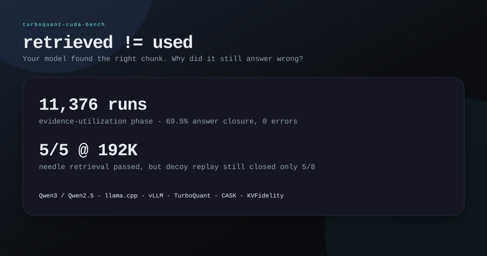

# Public benchmark packages

This directory is the public entry layer for `turboquant-cuda-bench`.

It contains only public-safe summaries, aggregate tables, sanitized JSON, and copied notes. Raw logs, private traces, operational scripts, and lab materials remain in their original folders.

## Packages

| Package | What it shows | Start here |
|---|---|---|
| `evidence-utilization/` | Retrieved evidence can fail to become the final answer. Rank, decoys-before, and distractor type dominate closure. | [`RESULTS.md`](evidence-utilization/RESULTS.md) |
| `vllm-cross-stack/` | vLLM vs llama.cpp cross-stack replay: 192K needles pass, decoy failures replicate, policy splice recovers. | [`decoy-replay-results.md`](vllm-cross-stack/decoy-replay-results.md) |
| `cask-kvfidelity-bridge/` | Action/target/source-rank split under FullKV, CASK, and TriAttention. | [`RESULTS.md`](cask-kvfidelity-bridge/RESULTS.md) |
| `kvfidelity/` | Paired action-trace evaluation for KV/cache changes, including v2 comparator, hold-out, and order-sensitivity notes. | [`kvfidelity-2026-05-07-summary.md`](kvfidelity/kvfidelity-2026-05-07-summary.md) |
| `evidence-paged-kv/` | CUDA kernel receipts v1→v7 for evidence-aware KV page access. v4 is the public receipt; v7 is the architecture direction. | [`RESULTS.md`](evidence-paged-kv/RESULTS.md) |
| `dashboard.html` | Static visual dashboard for the main numbers. | [`dashboard.html`](dashboard.html) |
| `assets/` | SVG cards/charts that GitHub can render directly in the README. | [`assets/`](assets/) |

## Visual assets

  

| Chart | File |
|---|---|
| Rank closure | [`assets/evidence-rank-closure.svg`](assets/evidence-rank-closure.svg) |
| Distractor taxonomy | [`assets/distractor-taxonomy.svg`](assets/distractor-taxonomy.svg) |
| Needle 192K vs decoys | [`assets/needle-192k-vs-decoys.svg`](assets/needle-192k-vs-decoys.svg) |
| Decoy vs policy splice | [`assets/decoy-vs-policy-splice.svg`](assets/decoy-vs-policy-splice.svg) |
| CASK bridge fidelity | [`assets/cask-bridge-fidelity.svg`](assets/cask-bridge-fidelity.svg) |
| KVFidelity trace drift | [`assets/kvfidelity-trace-drift.svg`](assets/kvfidelity-trace-drift.svg) |
| Evidence-Paged KV kernel receipts | [`assets/evidence-paged-kv-kernel-receipts.svg`](assets/evidence-paged-kv-kernel-receipts.svg) |

## Boundary

This directory is not a leaderboard. It is a public index of receipts.

Use these files to understand the result shape, then follow links back to the full repo for protocols, scripts, caveats, and raw/lab provenance where appropriate.
